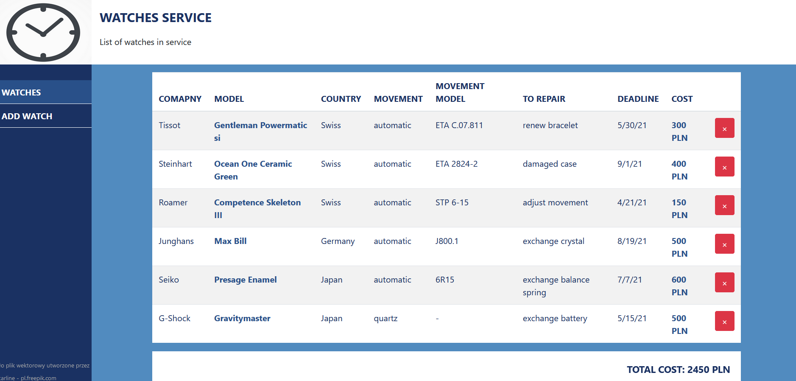
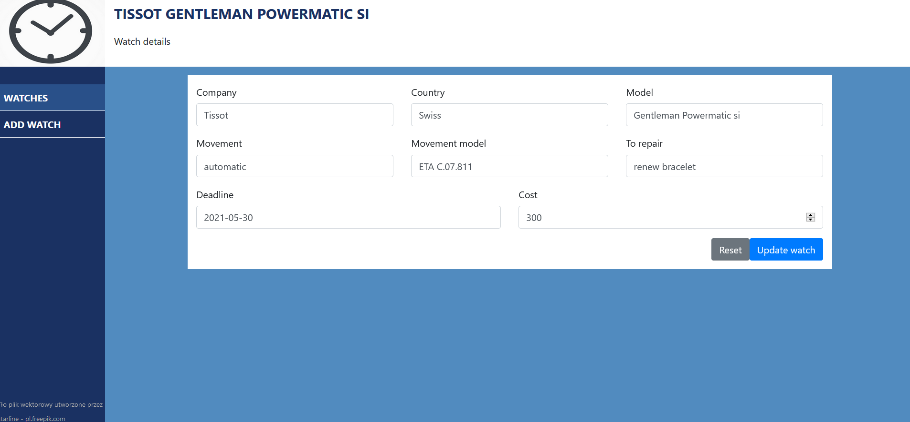
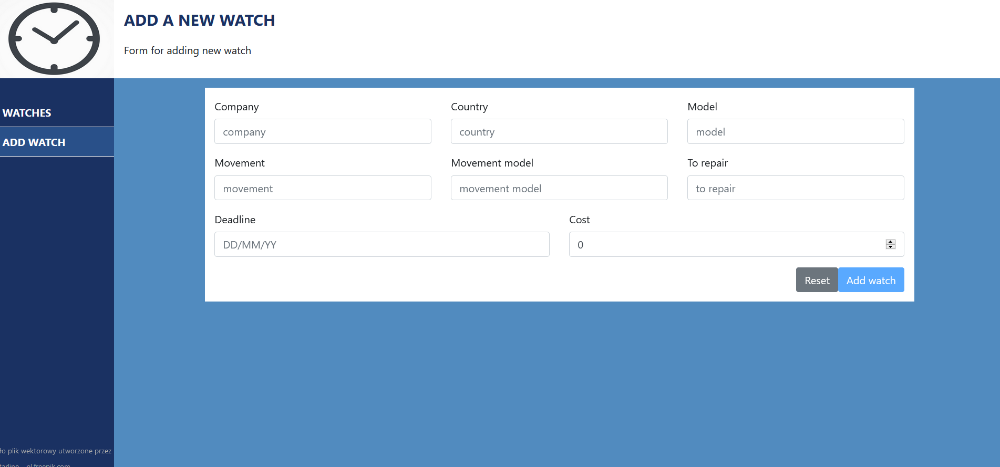
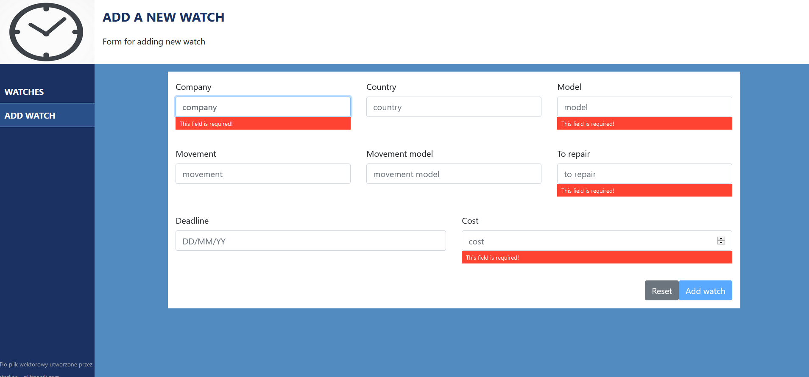

# WatchService

This is watch service application. In this project user can add, update, delete orders of watches repair. In application user can see a total cost all of orders.
This application uses Angular-serwer like a server with datas connected to mySql data base.

## Table of content
* [General info](#general-info)
* [Technologies](#technologies)
* [Setup](#setup)
* [Application](#application)

## General info

In this application user can manage orders of watches repairs. All operation on database are done in Angular-serwer using java. In this project I used Angular's Validators to valid 
datas from add new order form and update order form.

## Technologies

Project is created with:

* Angular CLI version 11.2.6
* Bootstrap version 4.6.0
* HTML
* CSS

## Setup

To run this project, download it to your IDE which operates Angular CLI. It is necessery to download Angular-serwer from my repositories and run it in your IDE wich operates 
Spring Boot. When Angular-serwer run, start this application and go to localhost:4200. It is necessary to configure Angular-serwer to your database programme in application.properties.

## Application

Below there are some pictures to demonstrate this application. 

